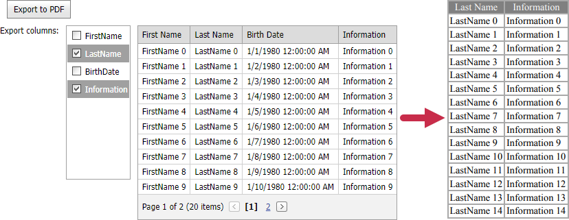

<!-- default badges list -->

[](https://supportcenter.devexpress.com/ticket/details/E3352)
[](https://docs.devexpress.com/GeneralInformation/403183)
<!-- default badges end -->
# Grid View for ASP.NET MVC - How to use the BeforeExport event to filter the exported columns
<!-- run online -->
**[[Run Online]](https://codecentral.devexpress.com/172941046/)**
<!-- run online end -->

This example demonstrates how to export custom (selected) columns of [GridView](https://docs.devexpress.com/AspNetMvc/8966/components/grid-view) to a PDF file.



The [BeforeExport](https://docs.devexpress.com/AspNetMvc/DevExpress.Web.Mvc.MVCxGridExportSettings.BeforeExport) event allows you to customize export settings before grid content is exported. You can use this event to hide and show data columns and add custom columns to the exported file.

In this example, a [ListBox](https://docs.devexpress.com/AspNetMvc/8990/components/data-editors-extensions/listbox) extension contains a list of grid column names and allows you to select the items. When a user clicks the _Export to PDF_ button, the list of selected column names is sent to the server.

```js
function ExportToPDF() {
    var names = GetSelectedItemsNames();
    if (!names) {
        alert("Choose columns to export");
        return;
    }
    document.getElementById("ExportColumnsNames").value = names;
    document.forms[0].submit();
}
function GetSelectedItemsNames() {
    var selectedItems = columnNames.GetSelectedValues();
    var result = "";
    for (var index = 0; index < selectedItems.length; index++) {
        result += selectedItems[index] + ";";
    }
    return result;
}
```
On the server, the `BeforeExport` event handler clears the [Columns](https://docs.devexpress.com/AspNet/DevExpress.Web.ASPxGridView.Columns) collection of the exported grid and populates it with the selected columns.

```csharp
gridVieewSettings.SettingsExport.BeforeExport = (sender, e) => {
    MVCxGridView gridView = sender as MVCxGridView;
    if (sender == null)
        return;
    gridView.Columns.Clear();
    foreach (var name in names) {
        if (string.IsNullOrEmpty(name)) continue;
        gridView.Columns.Add(new MVCxGridViewColumn(name));
    }
};
```

## Files to Review

- [Index.cshtml](./CS/E3352/Views/Home/Index.cshtml) 
- [HomeController.cs](./CS/E3352/Controllers/HomeController.cs) 

## Documentation 

- [Grid View Data Export](http://docs.devexpress.devx/AspNetMvc/16205/components/grid-view/export)
